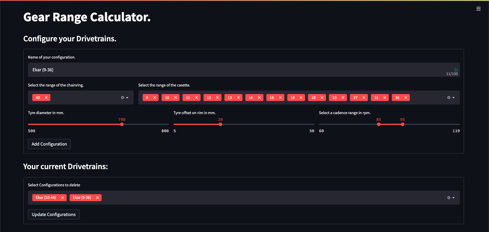
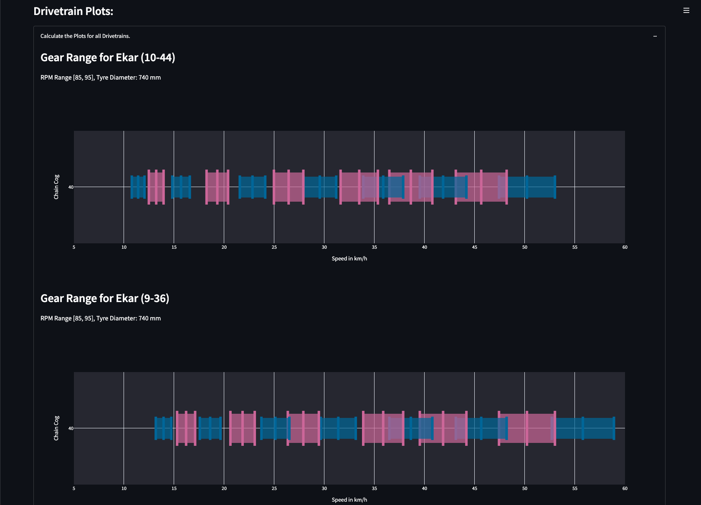

# Gear Range Calculator
This is a very simple streamlit application in order to compare different bicycle drivetrains by specifying:
* The front __chainring(s)__ by their number of cogs
* The __cassette__ also by their number of cogs
* The __wheel__ by its diamater and tyre offset
## Usage
### Local
Clone this repo and (prefarably in a virtual environment) install this package.
```bash
pip install .
````
Afterwards you can run this app on http://localhost:8501/ simply by
```bash
run_gearrange_frontend
```
### Web App
This tiny application is also deployed on streamlit where it can be used:

https://share.streamlit.io/mikewklm/gearing/gear_range_calc/gearrange_viewer.py
## Application Example
This is how the streamlit applications looks like:

